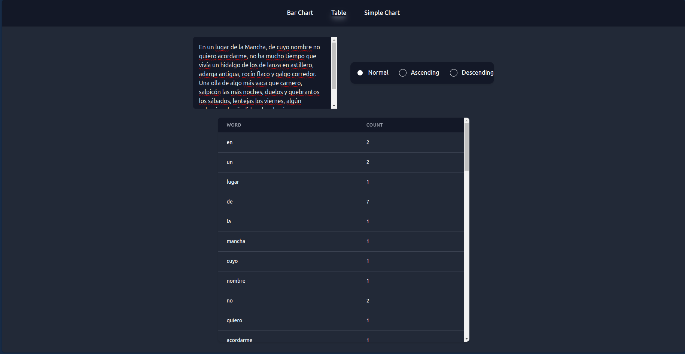
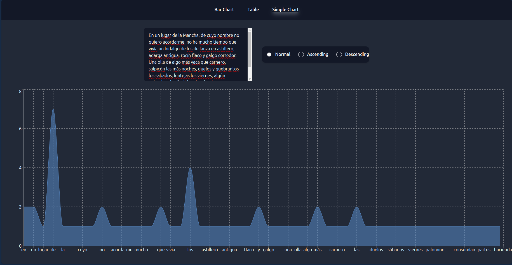
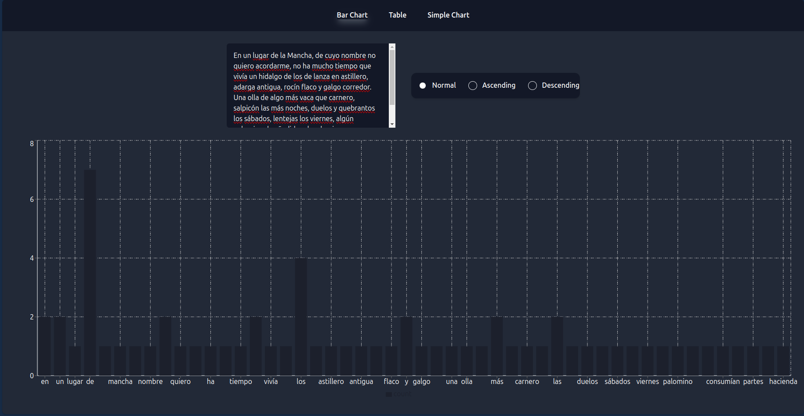

# SIEN Project

The SIEN project is a web application designed to perform word counting and display the results in a table and two charts. This project leverages modern tools and libraries to provide a robust and interactive user experience.

## Technologies Used

- **React**: A JavaScript library for building user interfaces, particularly for single-page applications. React is used to create interactive and dynamic web components.

- **Vite**: A modern build tool that provides a fast development environment with hot module replacement and optimized production builds. Vite is used for development and building the application.

- **Tailwind CSS**: A utility-first CSS framework that allows for rapid UI development. Tailwind CSS is used to style the application's components.

- **Recharts**: A library for building charts and visualizations in React. Recharts is used to render the charts in the application.

- **Vitest**: A testing framework for Vite projects. Vitest is used to run unit and integration tests for the application.

- **ESLint**: A tool for identifying and fixing problems in JavaScript code. ESLint helps maintain code quality and consistency across the project.

- **pnpm**: A fast and efficient package manager for JavaScript. pnpm is used to manage project dependencies.

- **Prop-Types**: A library for runtime type checking of React props. Prop-Types is used to validate the types of props passed to React components.

- **React Router DOM**: A library for handling routing in React applications. React Router DOM is used to manage navigation and rendering of different components based on the URL.

- **PostCSS**: A tool for transforming CSS with JavaScript plugins. PostCSS is used as part of the CSS build process.

- **Autoprefixer**: A PostCSS plugin that adds vendor prefixes to CSS rules. Autoprefixer is used to ensure compatibility with different browsers.

- **jsdom**: A JavaScript implementation of the DOM and HTML standards. jsdom is used in testing to simulate a web browser environment.

- **@testing-library/react**: A library for testing React components. It provides utilities to render and interact with React components in tests.

- **@types/react** and **@types/react-dom**: TypeScript type definitions for React and React DOM. These are used for TypeScript projects to provide type checking and code completion.

## Prerequisites

To run this project, you need to have the following installed:

- **Node.js**: A JavaScript runtime built on Chrome's V8 JavaScript engine. Download and install Node.js from [nodejs.org](https://nodejs.org/en).

- **npm**: The Node.js package manager, which comes bundled with Node.js. npm is used to manage project dependencies.

Optionally, you can use **pnpm** as the package manager for this project. If you do not have pnpm installed, you can install it using npm:

```bash
npm install -g pnpm
```

## Clone the Repository

To get started, you need to clone the repository. You can do this using either HTTPS or SSH.

**Clone using HTTPS:**

```bash
git clone https://github.com/finnisimo4768/SIEN-Project.git
```

**Clone using SSH:**

```bash
git clone git@github.com:finnisimo4768/SIEN-Project.git
```

After cloning the repository, navigate into the project directory:

```bash
cd SIEN-Project
```

## Install Dependencies

Once you are in the project directory, install the required dependencies. You can use either `pnpm` or `npm`.

**Using pnpm:**

```bash
pnpm install
```

**Using npm:**

```bash
npm install
```

This will install all the dependencies listed in the `package.json` file.

## Available Commands

Below is a list of available commands you can use during development, testing, and building the project.

- **`dev`**: Starts the development server. This command is used to run the application in development mode. The application will be available at [http://localhost:5173/](http://localhost:5173/). Use this command to see changes live as you develop.

  **Using pnpm:**

  ```bash
  pnpm dev
  ```

  **Using npm:**

  ```bash
  npm run dev
  ```

- **`build`**: Builds the application for production. This command compiles the source code into optimized files that are suitable for deployment. The output will be placed in the `dist` directory.

  **Using pnpm:**

  ```bash
  pnpm build
  ```

  **Using npm:**

  ```bash
  npm run build
  ```

- **`lint`**: Runs ESLint to analyze the code for style issues and errors. ESLint helps maintain code quality and consistency across the project.

  **Using pnpm:**

  ```bash
  pnpm lint
  ```

  **Using npm:**

  ```bash
  npm run lint
  ```

- **`preview`**: Previews the built application. This command starts a local server to serve the production build. Use it after building the application to test how it will behave in a production environment.

  **Using pnpm:**

  ```bash
  pnpm preview
  ```

  **Using npm:**

  ```bash
  npm run preview
  ```

- **`test`**: Runs the project tests using Vitest. This command executes all the test cases defined in the project to ensure that the application functions as expected.

  **Using pnpm:**

  ```bash
  pnpm test
  ```

  **Using npm:**

  ```bash
  npm run test
  ```

- **`coverage`**: Runs the tests and generates a code coverage report. This report provides insights into which parts of the code are covered by tests and which are not.

  **Using pnpm:**

  ```bash
  pnpm coverage
  ```

  **Using npm:**

  ```bash
  npm run coverage
  ```

- **`check`**: Runs ESLint to check all project files with extensions `.js`, `.jsx`, `.ts`, `.tsx` for any style issues or errors.

  **Using pnpm:**

  ```bash
  pnpm check
  ```

  **Using npm:**

  ```bash
  npm run check
  ```

- **`fix`**: Automatically fixes style issues and errors in all project files using ESLint. This command helps to clean up code by applying fixes where possible.

  **Using pnpm:**

  ```bash
  pnpm fix
  ```

  **Using npm:**

  ```bash
  npm run fix
  ```

## Text Area for Input

The application features a text area where users can enter or paste text to generate the word count. Here's how it works:

- **Text Area**: Located prominently within the application, this multi-line text area allows users to input or paste large amounts of text.

- **Example Text**: To test the functionality, you can use the following sample text:

  ```
  En un lugar de la Mancha, de cuyo nombre no quiero acordarme, no ha mucho tiempo que vivía un hidalgo de los de lanza en astillero, adarga antigua, rocín flaco y galgo corredor. Una olla de algo más vaca que carnero, salpicón las más noches, duelos y quebrantos los sábados, lentejas los viernes, algún palomino de añadidura los domingos, consumían las tres partes de su hacienda.
  ```

- **Generate Count**: Once text is pasted or typed into the text area, the application will automatically perform the word count and update the results in real-time.

- **Results Display**: The word count results are displayed in a table and visualized using charts, providing a comprehensive view of the text's word frequency.

## Data Display Selector

The application includes a data display selector implemented as a radio button group. This allows users to choose how the word count data is displayed. The available options are:

- **Ascending Order**: Displays the words starting from the lowest count to the highest.
- **Descending Order**: Displays the words starting from the highest count to the lowest.
- **Original Order**: Displays the words in the order they appeared in the original text.

Users can select their preferred display option using radio buttons, which will dynamically update the presentation of the word count data.

## Access the Application

After starting the development server with the `pnpm dev` or `npm run dev` command, you can access the application in your web browser at the following URL:

[http://localhost:5173/](http://localhost:5173/)

This URL will load the application where you can interact with it and view the results of the word counting functionality.

## Interface Screenshots

Here are some screenshots of the application's interface:

- **Interface Screenshot 1**:
  

- **Interface Screenshot 2**:
  

- **Interface Screenshot 3**:
  
